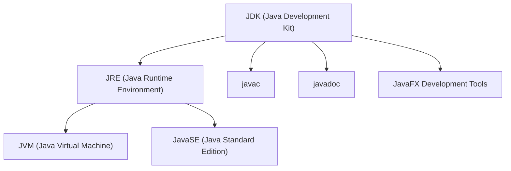

> 우리가 작성하는 자바 코드는 어떻게 실행되는 걸까?

면접에서도 자주 등장하는 질문이며 자바를 사용하는 프로그래머라면 알고있어야하는 자바의 실행과정과 기본 구조 + JDK, JRE, JavaSE에 대해서 알려드리겠습니다.

먼저 실행과정을 이해하려면 프로그래밍 언어에 대해 알고 있어야 합니다.

## 프로그래밍 언어란

> 사람과 컴퓨터가 대화하기 위해 필요한 언어

사람과 사람이 정보를 주고 받으려면 서로 알고 있는 약속된 언어가 필요합니다.
컴퓨터에게 정보를 줄 때도 마찬가지 입니다. 
컴퓨터에게 정보를 줄 때 언어가 필요하고 우린 그것을 `프로그래밍 언어`라고 합니다.

프로그래밍 언어는 고급언어와 저급언어로 나뉩니다.

 

### 고급언어

 > 사람들이 이해할 수 있는 언어(ex : `Java`, `C`, `C#`, `python`등)

컴퓨터는 사람의 언어를 바로 이해할 수 없기 때문에 컴파일(compile)이라는 과정을 통해 컴퓨터가 이해할 수 있는 0과 1로 이루어진 기계어로 변환한 후 컴퓨터가 사용합니다.
 
### 저급언어

> 컴퓨터가 직접 이해하고 실행할 수 있는 언어(ex : 기계어, 어셈블리어 등)

`기계어(mechine code)`란 0과 1의 명령어 비트로 이루어진 언어 입니다.
![[/assets/img/post_img/기계어.png]]
사진처럼 기계어는 오진 컴퓨터를 위해 만들어진 언어이기 때문에 사람은 그 의미를 이해하기 어렵습니다.

그래서 등장한 저급언어가 `어셈블리어(assembly languge)`입니다.
0과 1로 표현된 명렁어 비트로 이루어진 기계어를 읽기 편한 형태로 번역한 언어가 어셈블리어입니다.

어셈블리어 예시

<pre><code class="assembly">
 push        ebp 
 mov         ebp,esp  
 sub         esp,0E4h  
 push        ebx  
 push        esi  
 push        edi  
 lea         edi,[ebp+FFFFFF1Ch]  
 mov         ecx,39h  
 mov         eax,0CCCCCCCCh  
 rep stos    dword ptr es:[edi]  
 mov         ecx,9AC003h  
 call        009A1316  
 mov         dword ptr [ebp-8],1  
 mov         dword ptr [ebp-14h],2  
 mov         eax,dword ptr [ebp-8]  
 add         eax,dword ptr [ebp-14h]  
 mov         dword ptr [ebp-20h],eax  
 mov         eax,dword ptr [ebp-20h]  
 push        eax  
 push        9A7D08h  
 call        009A10CD  
 add         esp,8  
 xor         eax,eax  
 pop         edi  
 pop         esi  
 pop         ebx  
 add         esp,0E4h  
 cmp         ebp,esp  
 call        009A123F  
 mov         esp,ebp  
 pop         ebp  
 ret  

</code></pre>

 

---

 

## 바이트코드 파일과 자바 가상 머신

자바 소스 파일의 확장명은 `.java` 입니다. 
(텍스트 파일이므로 어떤 텍스트 에디터에서도 작성이 가능합니다.)

소스파일(`.java`)을 작성한 후에는 컴파일 과정이 필요합니다.
컴파일 결과는 확장명이 `.class`인 바이트코드파일로 생성됩니다.

바이트코드 파일(`.class`)은 운영체제와 상관없이 모두 동일한 내용으로 생성됩니다.

 

### 자바 가상 머신(Java Virtual Machine, JVM)

> 바이트 코드 파일을 완전한 기계어로 번역하고 실행시키는 것

JVM은 운영체제에서 이해하는 기계어로 번역해야 하므로 운영체제 별로 다르게 설치되어야 합니다.
따라서, JVM은 JDK와 함께 설치되기 때문에 운영체제 별로 설치되는 JDK가 다른 것입니다.

 

---

 

## JDK, JRE, JavaSE란?

자바를 공부한 사람이라면 한번쯤 궁금해 하는 주제이며, 면접에서도 자주 등장하는 질문입니다.

> JDK, JRE, JavaSE란 무엇인가?

보통 개발자들이 `개발환경 구축 시 자바 버전을 맞춘다`라는 말은 
⇢ `프로젝트 JDK버전을 맞춘다 라는 의미`로 사용됩니다.

 

### JDK(Java Development Kit)

> 자바 개발을 위한 도구 모음입니다. 
 
즉, 개발자들을 위한 도구입니다.
자바 소스 코드를 작성하고, 컴파일하고, 실행할 수 있는 도구를 포함합니다.
JDK에는 JRE도 포함되어 있습니다. 따라서 JDK를 설치하면 JRE도 함께 설치됩니다.

 

### JRE(Java Runtime Environment)

> 자바 애플리케이션을 실행하는 데 필요한 환경을 제공합니다.

자바 애플리케이션을 실행하기 위해 필요한 런타임 라이브러리, 가상 머신 등이 포함됩니다.
JRE는 개발 도구나 컴파일러는 포함하지 않습니다. 즉, 자바 애플리케이션을 실행하는 데만 필요한 것만 제공합니다.

 

###  Java SE(Java Standard Edition)

> 자바의 기본이 되는 표준 라이브러리와 API를 정의합니다.

Java SE는 자바 프로그래밍 언어의 기본이 되는 모든 요소를 포함합니다.
JDK와 JRE는 Java SE 사양을 구현하는 구현체입니다. 
따라서, JDK와 JRE를 설치하면 Java SE의 모든 기능과 API를 사용할 수 있습니다.

 

#### JavaSE API 예시
- `java.lang`: 기본 자료형, 문자열 처리, 예외 처리 등을 다루는 클래스 및 인터페이스를 제공합니다. `String`, `Integer`, `Object` 등이 여기에 속합니다.
- `java.util`: 다양한 유틸리티 및 데이터 구조 클래스를 포함합니다. `ArrayList`, `HashMap`, `Date` 등이 여기에 속합니다.
- `java.io`: 입출력 관련 기능을 다루는 클래스 및 인터페이스를 제공합니다. 파일 및 스트림 처리를 위한 클래스들이 여기에 속합니다.
- `java.net`: 네트워크 통신을 위한 클래스 및 인터페이스를 제공합니다. `URLConnection`, `Socket`, `ServerSocket` 등이 여기에 속합니다.

#### JavaSE 라이브러리 예시
-  `java.math`: 정밀 계산을 위한 클래스들을 제공합니다. `BigInteger`, `BigDecimal` 등이 여기에 속합니다.
- `java.security`: 보안 관련 기능을 다루는 클래스 및 인터페이스를 제공합니다. `MessageDigest`, `KeyPairGenerator`, `SecureRandom` 등이 여기에 속합니다.
- `java.awt`: 추상 윈도우 툴킷을 통해 그래픽 사용자 인터페이스를 구현하기 위한 클래스들을 제공합니다. `Button`, `Frame`, `Graphics` 등이 여기에 속합니다.
- `javax.swing`: 스윙 라이브러리를 통해 그래픽 사용자 인터페이스를 구현하기 위한 클래스들을 제공합니다. `JButton`, `JFrame`, `JPanel` 등이 여기에 속합니다.

  

     

참고
- [이것이 자바다](https://www.youtube.com/playlist?list=PLVsNizTWUw7EmX1Y-7tB2EmsK6nu6Q10q)
- [혼자공부하는컴퓨터구조+운영체제](https://www.youtube.com/playlist?list=PLVsNizTWUw7FCS83JhC1vflK8OcLRG0Hl)
- [ChatGPT](https://chat.openai.com/)

  

피드백은 언제든 감사하게 받겠습니다.
